# Placement Management System

The Placement Management System is designed to streamline the recruitment process for both students and companies. This platform helps students find suitable placement and internship opportunities and enables companies to recruit talented candidates efficiently.

## Features

### For Students:
- **Sign In/Sign Up:** Students can easily create accounts and log in.
- **Change Password:** Option to update their password.
- **Apply for Jobs:** Students can browse and apply for available job roles.
- **View Application Status:** Track the status of their job applications.
- **Update Profile:** Maintain and update their personal and academic details.

### For Companies:
- **Sign In/Sign Up:** Companies can create accounts and log in.
- **Post Job Openings:** Add new job roles and update existing ones.
- **Manage Applications:** Review and manage applications from students.
- **Select Candidates:** Shortlist and select candidates for job roles.
- **Track Applications:** Monitor the status of applications and job vacancies.

## Technology Stack

### Frontend:
- HTML, CSS
- Bootstrap
- JavaScript

### Backend:
- PHP
- SQL

### Authentication:
- Custom PHP-based authentication

## Database Design

### Normalization:
- Ensured data integrity and reduced redundancy by normalizing tables.

### Integrity Constraints:
- Implemented constraints to maintain data accuracy and reliability.

### Cursors, Triggers, Procedures:
- Counting the number of students per job role
- Calculating application statistics
- Summing up the total applications received by companies

## Screenshots

### Home Pages
**Index Page - Home 1**

**Index Page - Home 2**
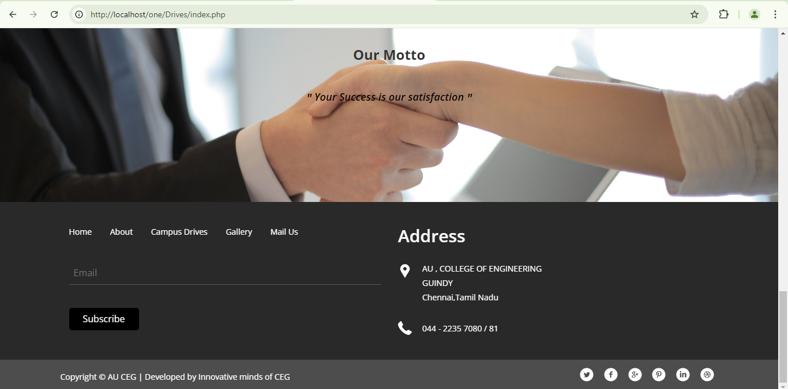

**Index Page - Home 3**
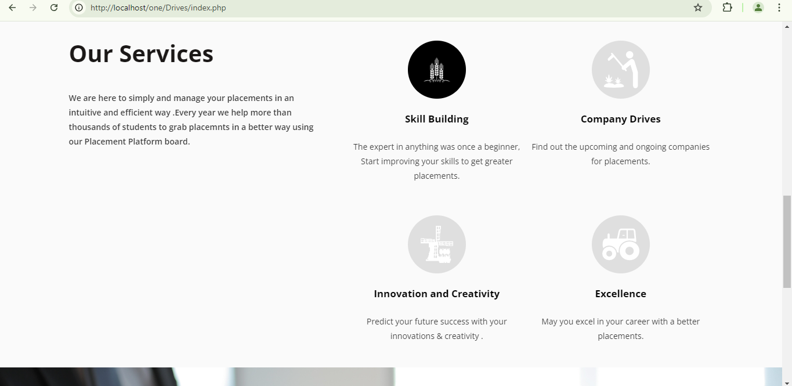

### Authentication Page
**Sign Up Page**
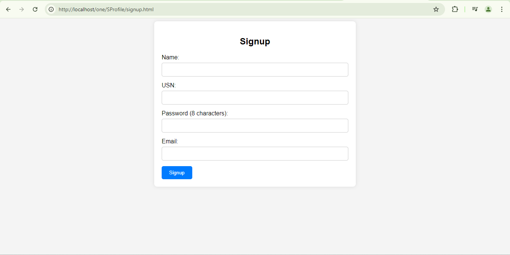

### Admin Pages
** Login Page**
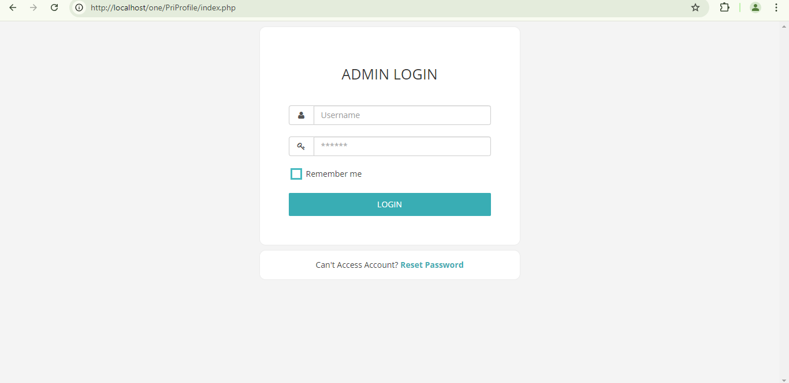

### Managing student
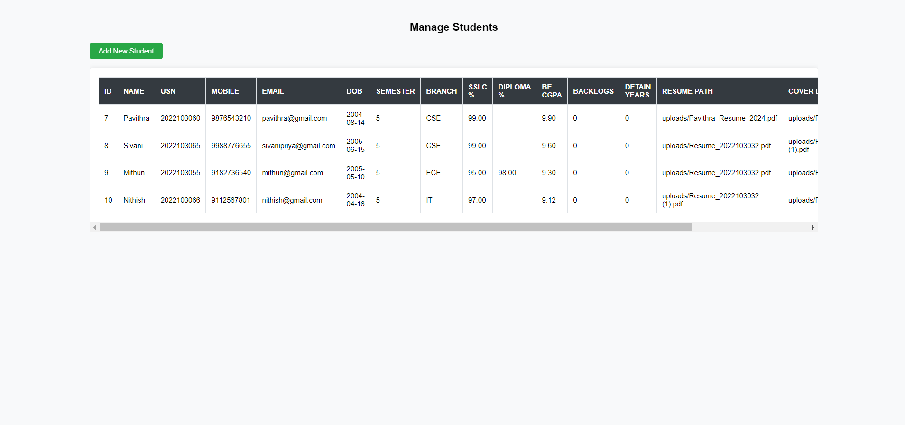

### Managing companies
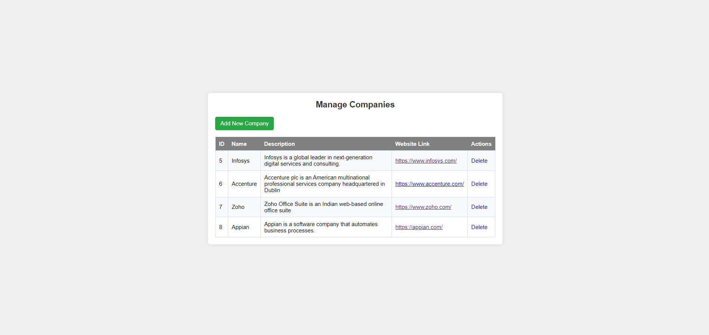

### Add Student or Company

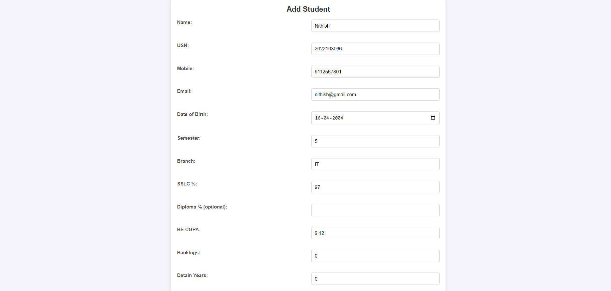
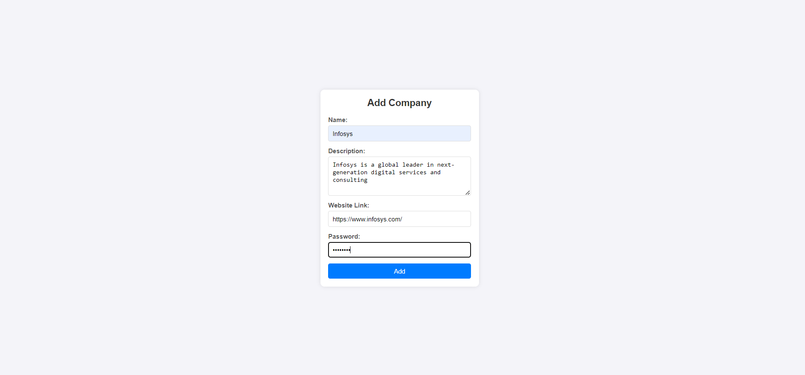

**Student Login Page**

### Login page
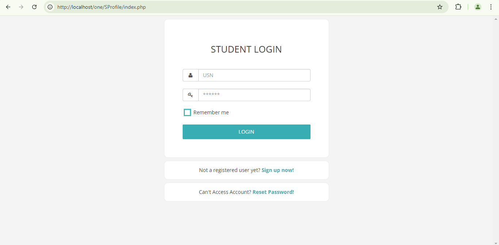

### Student Dashboard

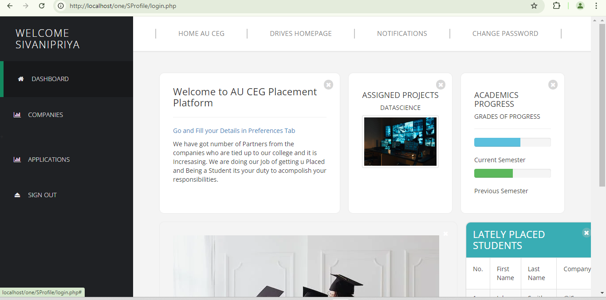

### Applications

### Job_postings

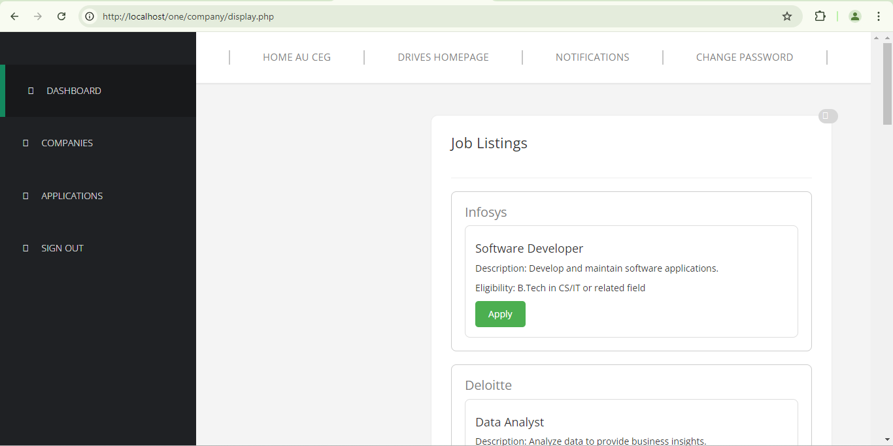

### Company Pages

**Company Login Page**
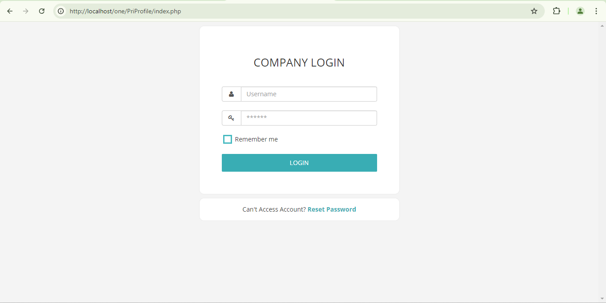

**Application List**
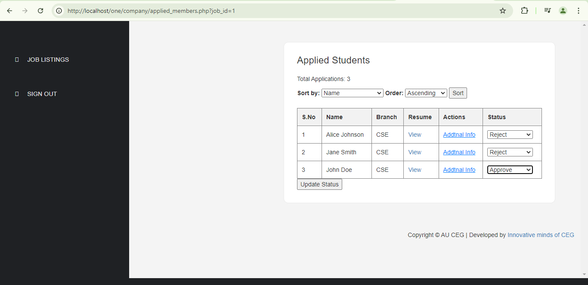

**Student Details Page**
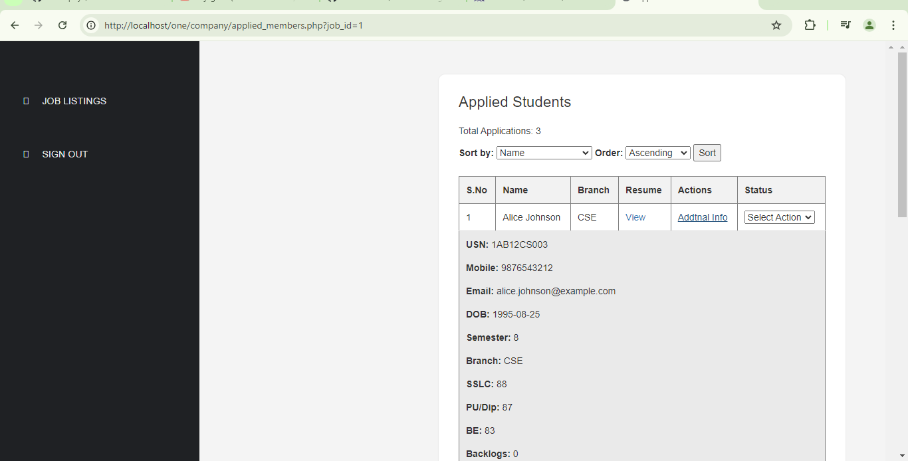

## PL/SQL Blocks Implemented

### Triggers:
- **Job Vacancy Filled:** Remove job role from listings when the vacancy is filled.
- **Company Closure:** Delete job roles and applications if a company is closed.
- **Student Selection:** Cancel other applications for a student once they are selected for a job role.

### Procedures:
- **Count Applications by Company:** Count the number of applications received by a company for a specific job role.
- **Count Applications by Student:** Count the number of applications submitted by a student.
- **List Job Roles by Skills:** List job roles that require specific skills.

### Functions:
- **Update Student Profile:** Allow students to update their profile details.
- **List Applications by Student:** Display the company names, applications, and statuses for an individual student.
- **List Job Offerings by Company:** Display job offerings posted by a specific company.

### Views:
- **Student Profile View:** Displays the profile information of a student, including their name, email, DOB, department, and password.

## Conclusion
This project was developed by me and my teammate. We designed the system architecture, implemented the database design, and developed the frontend and backend. The Placement Management System provides a comprehensive solution for managing placements and internships, making the process seamless for both students and companies.
